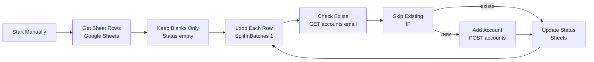

# n8n-instantly-smtp-bulk-upload

> Open-source n8n workflow that bulk-creates custom SMTP accounts in Instantly.ai API v2 from Google Sheets — with existence checks, sequential looping, and auto status write-back. For cold-email operators and automation engineers.

<!-- TODO: Add docs/assets/demo.gif — Manual trigger processing 3 blank rows -->

## Contents

- [Features](#features)
- [Architecture](#architecture)
- [Prerequisites](#prerequisites)
- [Quickstart](#quickstart)
- [Google Sheet Schema](#google-sheet-schema)
- [Configuration](#configuration)
- [Usage](#usage)
- [Troubleshooting](#troubleshooting)
- [FAQ](#faq)
- [Roadmap](#roadmap)
- [Contributing](#contributing)
- [License](#license)
- [Acknowledgements](#acknowledgements)

## Features

| Feature                | How it works in this workflow                                                                        |
| ---------------------- | ---------------------------------------------------------------------------------------------------- |
| Blank-only processing  | `Keep Blanks Only` filters `Status is empty` — safe idempotent reruns                                |
| Existence guard        | `GET /api/v2/accounts/{email}` + `Skip Existing` IF prevents duplicates                              |
| Custom SMTP mapping    | `POST /api/v2/accounts` with `provider_code: 1`, trims/lowercases email, casts ports with `Number()` |
| Sequential reliability | `Loop Each Row (SplitInBatches batchSize 1)` + 30s timeout, 3 retries, 2s wait                       |
| Auto write-back        | `Update Status` (`appendOrUpdate` match on `Email`) writes `Added` or `Failed - reason`              |

What it does NOT do: manual trigger only, no warm-up management, no parallel bulk, no OAuth mailbox flows.

## Architecture

Canonical workflow: [`workflows/instantly-smtp-accounts-bulk-upload.json`](./workflows/instantly-smtp-accounts-bulk-upload.json) — 8 nodes, `executionOrder: v1`.

1. **Start Manually** — manual entry point, no schedule.
2. **Get Sheet Rows** — reads all rows (12-column contract).
3. **Keep Blanks Only** — keeps `Status is empty`.
4. **Loop Each Row** — `batchSize: 1`, `loop` per row, `done` ends.
5. **Check Exists** — `GET /api/v2/accounts/{email}`; 404 routes to create via error output.
6. **Skip Existing** — `$json.email notEmpty` means exists.
7. **Add Account** — `POST /api/v2/accounts`, 12 fields from `$('Loop Each Row').item.json`.
8. **Update Status** — `appendOrUpdate` matching `Email`, writes outcome, loops back.

## Prerequisites

- n8n >= 1.x (Cloud or self-hosted), ability to import JSON + create credentials
- Google account with Sheets API + Google Sheets OAuth2 credential
- Instantly.ai workspace with paid plan + V2 API key (`accounts:read` + `accounts:create`)
- Google Sheet with exact 12 headers (see below), shared to OAuth identity
- Outbound HTTPS to `https://api.instantly.ai`

Last tested: n8n 1.x + Instantly API v2 on 2026-09-08.

## Quickstart

1. Download [`workflows/instantly-smtp-accounts-bulk-upload.json`](./workflows/instantly-smtp-accounts-bulk-upload.json), then n8n > Workflows > Import from File.
2. Copy [`examples/sheets-schema.csv`](./examples/sheets-schema.csv) headers into a new sheet, share it.
3. In `Get Sheet Rows` + `Update Status`, select your Google credential, set Document to `YOUR_GOOGLE_SHEET_ID`, sheet to your tab.
4. In `Check Exists` + `Add Account`, replace header with `Bearer YOUR_INSTANTLY_API_KEY`, verify `Content-Type: application/json` on POST.
5. Add 1 test row with blank `Status` > Execute workflow > verify `Added` in sheet + account in Instantly.

## Google Sheet Schema

| Column          | Type          | Required | Notes                                                               |
| --------------- | ------------- | -------- | ------------------------------------------------------------------- |
| `Email`         | string email  | Yes      | Trimmed + lowercased, matching key, unique                          |
| `First Name`    | string        | Yes      | Trimmed                                                             |
| `Last Name`     | string        | Yes      | Trimmed                                                             |
| `IMAP Username` | string        | Yes      | Usually = Email                                                     |
| `IMAP Password` | secret string | Yes      | Never commit, no trim                                               |
| `IMAP Host`     | hostname      | Yes      | e.g. `mail.example.com`                                             |
| `IMAP Port`     | number string | Yes      | `993`, cast with `Number()`                                         |
| `SMTP Username` | string        | Yes      | Usually = Email                                                     |
| `SMTP Password` | secret string | Yes      | Never commit, no trim                                               |
| `SMTP Host`     | hostname      | Yes      | e.g. `mail.example.com`                                             |
| `SMTP Port`     | number string | Yes      | `587`, cast with `Number()`                                         |
| `Status`        | string        | No       | Leave blank to process; workflow writes `Added` / `Failed - reason` |

Rules: header case-sensitive, no extra spaces, `Status` blank = todo, `Email` unique.

## Configuration

> [!CAUTION]
> Never commit real keys, Sheet IDs, or passwords. Use `YOUR_INSTANTLY_API_KEY` / `YOUR_GOOGLE_SHEET_ID` placeholders. See [SECURITY.md](./SECURITY.md).

- `Check Exists`: `GET https://api.instantly.ai/api/v2/accounts/{{ $json.Email }}`, `Authorization` header, timeout 30000, retry 3x/2000ms, `onError: continueErrorOutput`.
- `Add Account`: `POST https://api.instantly.ai/api/v2/accounts`, same auth + JSON body via `JSON.stringify` with `provider_code: 1`, `trim()` / `toLowerCase()` / `Number()`. See [`examples/sample-payload-post-accounts.json`](./examples/sample-payload-post-accounts.json).
- `Update Status`: `appendOrUpdate`, `matchingColumns: [Email]`, `Status = {{ $json.error ? 'Failed - ...' : 'Added' }}`.
- `Loop Each Row`: `batchSize: 1` — keep sequential for rate safety.

## Usage

1. Add/correct rows, ensure `Status` blank for rows to process.
2. Open workflow > Execute workflow, watch loop progress.
3. Review `Status`: `Added` = created or already existed, `Failed - message` = needs triage.
4. To retry failures, clear those `Status` cells to blank and rerun. Processed rows are auto-skipped.
5. For 500+ rows, run in tranches of 50–200 and leave the runner open (Instantly 100 req/s, 6000 req/min shared).

## Troubleshooting

| Symptom                    | Likely cause                                 | First fix                                                         |
| -------------------------- | -------------------------------------------- | ----------------------------------------------------------------- |
| No rows processed          | No blank `Status` or header mismatch         | Check exact `Status` empty + header case                          |
| 401 Unauthorized           | Placeholder key not replaced / revoked       | Update both HTTP nodes, same key                                  |
| 402 Payment Required       | No paid Instantly plan                       | Upgrade workspace, rerun blanks                                   |
| 403 scope                  | Key lacks `accounts:create`                  | Recreate key with read+write scopes                               |
| 429 rate limit             | Too fast / parallel runs                     | Keep batch 1, add Wait, rerun blanks                              |
| `Failed - NaN` / 400 ports | Text in port cells                           | Ensure numeric `993`/`587`, code casts with `Number()`            |
| Status never updates       | `Update Status` value empty / Email mismatch | Verify mapping has Email+Status, matching on `Email`, trim spaces |
| Google 403                 | Sheet not shared to OAuth identity           | Share sheet, reconnect credential                                 |

See [`docs/05-TROUBLESHOOTING.md`](./docs/05-TROUBLESHOOTING.md).

## FAQ

- Does rerunning create duplicates? No — GET + IF skips existing; blank filter skips done.
- Custom SMTP vs Gmail OAuth? This uses `provider_code: 1` custom SMTP/IMAP only.
- Schedule instead of manual? Swap Manual Trigger for Schedule, keep blank filter.
- Why sequential? API pacing + accurate per-row write-back.
- Safe to edit? Safe: timeouts, retries, Sheet ID. Test before changing body mapping or matchingColumns.

## Roadmap

- [ ] Scheduled trigger variant + batch size config
- [ ] Dry-run validation mode (no POST)
- [ ] Separate `Skipped - Exists` vs `Added` status
- [ ] Warm-up flag mapping
- [ ] Demo GIF + execution dashboard query

## Contributing

Contributions welcome! See [CONTRIBUTING.md](./CONTRIBUTING.md). Open an issue first for major changes. No secrets in PRs.

## License

MIT — free for personal/commercial use. See [LICENSE](./LICENSE).

## Acknowledgements

- [n8n](https://n8n.io/) automation platform + Sheets/HTTP nodes
- [Instantly.ai API v2](https://developer.instantly.ai/)
- [Google Sheets API](https://developers.google.com/sheets/api)
