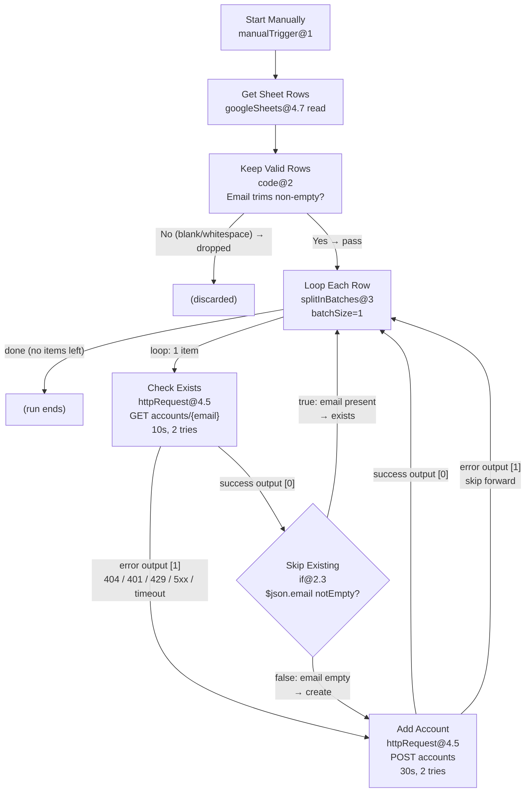

# n8n-instantly-smtp-bulk-upload — Technical Reference Guide

> **Workflow:** `Instantly SMTP Accounts – Bulk Upload` (live n8n canvas)
> **n8n executionOrder:** `v1` · **Nodes:** 7 · **Trigger:** Manual
> **Audience:** Builders, operators, reviewers
>
> **Source-of-truth notice.** The live canvas is canonical. The checked-in
> `workflows/instantly-smtp-accounts-bulk-upload.json` is an older 8-node
> revision (with a `Status` write-back column) — do not import it until it
> is re-exported. This guide tracks the live 7-node, status-less workflow.

---

## Table of Contents

- [1. Overview](#1-overview)
- [2. Repository Map](#2-repository-map)
- [3. Google Sheet Schema — 11 Columns](#3-google-sheet-schema--11-columns)
- [4. Connection Map and Control Flow](#4-connection-map-and-control-flow)
- [5. Node 1 — Start Manually (`manualTrigger@1`)](#5-node-1--start-manually-manualtrigger1)
- [6. Node 2 — Get Sheet Rows (`googleSheets@4.7` Read)](#6-node-2--get-sheet-rows-googlesheets47-read)
- [7. Node 3 — Keep Valid Rows (`code@2` Trim Gate)](#7-node-3--keep-valid-rows-code2-trim-gate)
- [8. Node 4 — Loop Each Row (`splitInBatches@3`)](#8-node-4--loop-each-row-splitinbatches3)
- [9. Node 5 — Check Exists (`httpRequest@4.5` GET)](#9-node-5--check-exists-httprequest45-get)
- [10. Node 6 — Skip Existing (`if@2.3`)](#10-node-6--skip-existing-if23)
- [11. Node 7 — Add Account (`httpRequest@4.5` POST)](#11-node-7--add-account-httprequest45-post)
- [12. Data Shapes](#12-data-shapes)
- [13. Inlined Samples](#13-inlined-samples)
- [14. Instantly v2 API Subset](#14-instantly-v2-api-subset)
- [15. Environment Reference (`.env`)](#15-environment-reference-env)
- [16. Hardening — Guards and Traps](#16-hardening--guards-and-traps)
- [17. Operations Cheatsheet](#17-operations-cheatsheet)
- [18. FAQ](#18-faq)
- [19. Roadmap](#19-roadmap)
- [Appendix A — Full Expression Inventory](#appendix-a--full-expression-inventory)
- [Appendix B — Version Pin Table](#appendix-b--version-pin-table)

---

## 1. Overview

This guide is the normative technical reference for the
`n8n-instantly-smtp-bulk-upload` workflow.

The workflow bulk-creates custom SMTP/IMAP sending accounts in
Instantly.ai from rows in a Google Sheet, one row at a time,
with skip-if-exists semantics and skip-on-failure behavior.
There is no write-back of any kind: the sheet is read-only input,
and outcomes are observed in the n8n execution log plus the
Instantly dashboard count.

### 1.1 What it does

1. Reads every row from a configured Google Sheet (11 columns).
2. Keeps only rows whose `Email` has non-whitespace content.
3. Loops rows sequentially with `batchSize: 1`.
4. For each row, `GET /api/v2/accounts/{email}` to check existence.
5. Branches on the GET result:
   - Exists → loop straight back (no POST, no trace but the log).
   - Not exists → `POST /api/v2/accounts` with `provider_code: 1`.
6. POST failures route back to the loop via the error output —
   the run continues with the next row.
7. Ends on the loop's `done` branch.

### 1.2 Design principles

- **Sequential over parallel.**
  One API write at a time avoids Instantly rate-limit bursts.
- **Safe reruns, no cursor.**
  Every run re-checks live Instantly state; existing accounts skip,
  only missing accounts POST. There is no Status column to maintain.
- **Fail-row, not fail-run.**
  `Add Account` uses `onError: continueErrorOutput` back to the loop
  so one bad credential, typo, or 4xx does not abort the batch.
  The old per-row Status audit trail is gone — the execution log
  plus dashboard delta is the audit trail.
- **No silent trim of secrets.**
  Passwords are passed verbatim. Everything else human-typed
  (`email`, names, hosts, usernames) is trimmed.
- **Explicit types on the wire.**
  `provider_code`, `imap_port`, `smtp_port` are JSON numbers,
  never quoted strings.
- **Asymmetric timeouts.**
  Lookups are instant (GET: 10 s, 2 tries); creates verify live
  mailboxes (POST: 30 s, 2 tries). A 10 s POST limit caused real
  `ECONNABORTED` timeouts in production — do not tighten it.

### 1.3 Node inventory

| # | Name | Type | typeVersion | Role |
|---|---|---|---|---|
| 1 | Start Manually | `n8n-nodes-base.manualTrigger` | 1 | Manual entry point |
| 2 | Get Sheet Rows | `n8n-nodes-base.googleSheets` | 4.7 | Read all sheet rows |
| 3 | Keep Valid Rows | `n8n-nodes-base.code` | 2 | Trim-aware Email gate |
| 4 | Loop Each Row | `n8n-nodes-base.splitInBatches` | 3 | Sequential loop, `batchSize: 1` |
| 5 | Check Exists | `n8n-nodes-base.httpRequest` | 4.5 | `GET accounts/{email}` |
| 6 | Skip Existing | `n8n-nodes-base.if` | 2.3 | Branch on `$json.email` notEmpty |
| 7 | Add Account | `n8n-nodes-base.httpRequest` | 4.5 | `POST accounts`, `provider_code: 1` |

### 1.4 Execution settings

```json
{
  "executionOrder": "v1",
  "binaryMode": "separate",
  "saveExecutionProgress": true,
  "saveManualExecutions": true,
  "saveDataErrorExecution": "all",
  "saveDataSuccessExecution": "none"
}
```

Notes:

- `saveDataSuccessExecution: none` keeps SMTP passwords out of history.
- `saveManualExecutions: true` is load-bearing: with it off, manual
  runs are never stored and failures leave no audit trail. Do not
  disable it to "save space" — this exact mistake once made a failed
  run uninspectable.
- `active: false` by default. This workflow is manual-only.

---

## 2. Repository Map

```text
.
├── workflows/
│   └── instantly-smtp-accounts-bulk-upload.json   # STALE 8-node export — do not import
├── docs/
│   ├── README.md
│   ├── GUIDE.md
│   └── RUNBOOK.md
├── README.md
├── LICENSE
├── .gitignore
└── .env.example
```

Canonical sources of truth:

- Workflow topology: the **live n8n canvas** (repo JSON is stale).
- Sheet contract: header block in [§3](#3-google-sheet-schema--11-columns).
- POST contract: sample body in [§13.1](#131-sample-post-json).
- Secrets template: `.env.example`.

---

## 3. Google Sheet Schema — 11 Columns

The sheet contains exactly these 11 headers in row 1,
spelled exactly as shown (case-sensitive, single spaces).
There is deliberately no twelfth column.

> Header block (copy-paste safe):

```csv
Email,First Name,Last Name,IMAP Username,IMAP Password,IMAP Host,IMAP Port,SMTP Username,SMTP Password,SMTP Host,SMTP Port
```

### 3.1 Schema table

| Column | Type | Required | Transform | Example | Failure |
|---|---|---|---|---|---|
| `Email` | string (email) | **Yes** | `trim() + toLowerCase()` in GET URL and POST `email` | `john.doe@example.com` | Blank/whitespace-only rows are dropped by the gate; malformed → `400/422` on POST, skipped forward |
| `First Name` | string | **Yes** | `.toString().trim()` | `John` | Leading/trailing spaces sent verbatim if transform removed; API may `400` on empty |
| `Last Name` | string | **Yes** | `.toString().trim()` | `Doe` | Same as First Name; empty last name risks `422` |
| `IMAP Username` | string | **Yes** | `.toString().trim()` | `john.doe@example.com` | Untrimmed whitespace causes IMAP auth failure post-creation (account created but broken) |
| `IMAP Password` | string (secret) | **Yes** | **NO trim** — `.toString()` only | `xY9#qW2!vLp$7` | Trimming breaks passwords with leading/trailing spaces; never log this value |
| `IMAP Host` | string (hostname) | **Yes** | `.toString().trim()` | `imap.example.com` | Trailing space or `https://` prefix causes connection failure |
| `IMAP Port` | integer-as-string in Sheet → number on wire | **Yes** | `Number(...)` | `993` | Empty/alpha → `NaN` → `400/422`; see [NaN-port guard](#161-nan-port-guard) |
| `SMTP Username` | string | **Yes** | `.toString().trim()` | `john.doe@example.com` | Same whitespace risk as IMAP Username |
| `SMTP Password` | string (secret) | **Yes** | **NO trim** — `.toString()` only | `sMtP$3cReT!9` | Same as IMAP Password; keep verbatim |
| `SMTP Host` | string (hostname) | **Yes** | `.toString().trim()` | `smtp.example.com` | Same as IMAP Host |
| `SMTP Port` | integer-as-string in Sheet → number on wire | **Yes** | `Number(...)` | `587` | Same `NaN` risk; typical values `587` (STARTTLS) or `465` (SSL) |

### 3.2 Detailed column notes

#### `Email` (key)

- The loop identity for every row: GET URL, POST `email`, IF-branch context.
- Must be unique per row. In-sheet duplicates POST twice; the second
  `400`s and skips forward — harmless but wasteful. Dedupe column A
  before running.
- Normalized to lowercase on every API call.
- Rows with blank or whitespace-only `Email` never enter the loop
  (dropped by `Keep Valid Rows`). Delete empty trailing rows anyway —
  a clean sheet runs cleaner.

#### `First Name` / `Last Name`

- Trimmed. Empty after trim is sent as `""`.
- Instantly generally requires non-empty names for deliverability display.
- Do not pass `null`. The workflow always stringifies.

#### `IMAP Username` / `SMTP Username`

- Usually identical to `Email`, but may differ on custom setups.
- Trimmed independently of `Email`.
- Case is preserved (only `Email` is lowercased).

#### `IMAP Password` / `SMTP Password`

- **Never trimmed. Never logged. Never pasted into issues.**
- `.toString()` only, preserving every character including
  leading/trailing spaces.
- If your provider auto-strips spaces, you must pre-normalize
  deliberately — do not change the workflow default.

#### `IMAP Host` / `SMTP Host`

- Bare hostname only. No scheme, no port suffix, no path.
- Correct: `imap.example.com`.
- Wrong: `https://imap.example.com`, `imap.example.com:993`.

#### `IMAP Port` / `SMTP Port`

- Entered as plain digits in the Sheet (`993`, `587`).
- Converted with `Number()` in `Add Account`.
- Common pairs:
  - IMAP SSL: `993`; IMAP STARTTLS: `143`.
  - SMTP submission: `587`; SMTP SSL: `465`.
- See [NaN-port guard](#161-nan-port-guard) for hardening.

### 3.3 Validation checklist before each run

- [ ] Row 1 headers match the CSV header block exactly (11 columns).
- [ ] No extra columns; no `Status` column (legacy exports had one — delete it).
- [ ] `Email` column has no leading/trailing spaces in the raw cell.
- [ ] Ports are digits only, no `993/tcp` or quoted `"993"`.
- [ ] Passwords pasted without accidental line breaks.
- [ ] Empty trailing rows deleted.

---

## 4. Connection Map and Control Flow

### 4.1 Connection map table

| From | Output | To | When |
|---|---|---|---|
| Start Manually | `main` | Get Sheet Rows | Manual execution |
| Get Sheet Rows | `main` | Keep Valid Rows | After Sheet read |
| Keep Valid Rows | `main` | Loop Each Row | Only rows with real `Email` pass |
| Loop Each Row | `main[1]` (loop) | Check Exists | One item per iteration; `main[0]` (done) terminates |
| Check Exists | `main[0]` (success) | Skip Existing | GET returned 2xx with JSON body |
| Check Exists | `main[1]` (error output) | Add Account | GET errored (`continueErrorOutput`); 404 is the intended “not found → create” signal — see caveat below |
| Skip Existing | `main[0]` (true) | Loop Each Row | `$json.email` notEmpty → account exists, clean skip |
| Skip Existing | `main[1]` (false) | Add Account | `$json.email` empty/missing → create |
| Add Account | `main[0]` (success) | Loop Each Row | POST 2xx → next row |
| Add Account | `main[1]` (error output) | Loop Each Row | POST 4xx/5xx/timeout → skip forward, logged in execution |

> **Caveat on `Check Exists → Add Account (error output)`:**
> Any GET error (404, 401, 429, 5xx, timeout)
> flows to `Add Account` via the error output.
> A `404` is the intended “not found → create” signal.
> A `401/429/5xx` will also attempt creation and then skip forward
> on the POST error branch if creation also fails.
> Do not treat error-output routing as proof of non-existence.

### 4.2 Full mermaid graph



### 4.3 Loop semantics

- `splitInBatches@3` with default `batchSize: 1` emits one item
  on the loop output per iteration.
- Three back-edges converge on `Loop Each Row` (skip, success, error).
  n8n routes each completion signal to fetch the next item.
- When no items remain, the `done` output fires (connected to nothing),
  ending the run cleanly.
- Do **not** insert concurrency, batch-size increases, or parallel
  branches inside the loop without re-testing Sheet races
  and Instantly rate limits.

### 4.4 Error-branch semantics

- `onError: continueErrorOutput` on both HTTP nodes splits each
  node into two outputs: `[0]` success, `[1]` error-as-item.
- All three non-terminal edges (skip-true, POST success, POST error)
  converge on the loop. Nothing is recorded per row — the execution
  log is the only record. Inspect the failed item's `$json.error`
  there.
- Pre-loop nodes (`Get Sheet Rows`, `Keep Valid Rows`) use default
  `stopWorkflow` error behavior: if the sheet can't be read, the run
  halts loudly instead of looping over nothing.

---

## 5. Node 1 — Start Manually (`manualTrigger@1`)

### 5.1 Purpose

Manual entry point. No schedule, no webhook. Operator clicks
**Execute workflow** in n8n.

### 5.2 Parameters (literal)

```json
{
  "parameters": {},
  "name": "Start Manually",
  "type": "n8n-nodes-base.manualTrigger",
  "typeVersion": 1
}
```

### 5.3 Expressions

None. No inputs, no configuration.

### 5.4 Pitfalls

- Forgetting the run is manual and expecting automatic pickup
  of new Sheet rows. There is no polling. Rerun manually.
- Activating the workflow in n8n does nothing useful —
  there is no active trigger to listen. Keep `active: false`.
- Running twice concurrently can double-create. Wait for the first
  execution to finish (reruns are idempotent via GET-skip, but
  concurrent runs can still race the same missing email twice).

### 5.5 Version pin

- `manualTrigger@1`. Stable. No reason to upgrade unless n8n
  deprecates v1. Validate after any major n8n upgrade.

---

## 6. Node 2 — Get Sheet Rows (`googleSheets@4.7` Read)

### 6.1 Purpose

Reads all rows from the configured spreadsheet tab. Read-only —
nothing downstream ever writes to the sheet.

### 6.2 Parameters

Document ID + sheet tab (list-mode references, wired in the n8n UI),
default **Read** operation. Credentials: Google Sheets OAuth2
(read scope suffices).

### 6.3 Expressions

None inside parameters. `documentId` and `sheetName` are static
list-mode references.

### 6.4 Output shape

One item per Sheet row (excluding header), e.g.:

```json
{
  "Email": "john.doe@example.com",
  "First Name": "John",
  "Last Name": "Doe",
  "IMAP Username": "john.doe@example.com",
  "IMAP Password": "dummy-imap-pass-1",
  "IMAP Host": "imap.example.com",
  "IMAP Port": "993",
  "SMTP Username": "john.doe@example.com",
  "SMTP Password": "dummy-smtp-pass-1",
  "SMTP Host": "smtp.example.com",
  "SMTP Port": "587"
}
```

> Note: Ports arrive as **strings** from Sheets (`"993"`).
> They become numbers only in `Add Account` via `Number()`.

### 6.5 Pitfalls

- Wrong tab selected (`sheetName` is a display name / GID-backed list value).
  Renaming the tab breaks the list reference — re-select it.
- Google credential lacks access → node errors before any filtering,
  halting the run (correct — loud, not silent).
- Header rename (e.g. `email` lowercase) silently produces
  `undefined` downstream and `NaN` ports. Headers are case-sensitive.
- Empty trailing rows in Sheets emit items with empty fields.
  `Keep Valid Rows` drops them — but delete them anyway for a clean sheet.

### 6.6 Version pin

- `googleSheets@4.7`. Pinned. v4.x changed `documentId`/`sheetName`
  to object-mode (`{ mode, value }`). Do not downgrade to v3
  without rewriting these fields.

---

## 7. Node 3 — Keep Valid Rows (`code@2` Trim Gate)

### 7.1 Purpose

Drops every row without a usable email before the loop, so phantom
rows can never reach the POST body expression (where an `undefined`
email produces invalid JSON and a confusing failure).

### 7.2 Code (literal)

```javascript
// Run Once for All Items. Returns original item objects untouched
// so downstream pairedItem references stay intact.
return $input.all().filter((item) => String(item.json?.Email ?? '').trim() !== '');
```

- Type: `n8n-nodes-base.code`, typeVersion `2`,
  `mode: runOnceForAllItems`, `language: javaScript`.

### 7.3 Why Code and not Filter

n8n's Filter string `isEmpty`/`notEmpty` treats `" "` (a whitespace-only
trailing cell) as non-empty. Phantom rows therefore sailed through the
old filter into the loop and crashed the POST body with
`The value in the "JSON Body" field is not valid JSON` — a full debugging
session was spent on exactly this before the trim-aware gate replaced it.

### 7.4 Pitfalls

- Returning rebuilt `{ json: {...} }` objects instead of the original
  items would break `$('Loop Each Row').item` pairing downstream.
  The gate returns the original item objects — keep it that way.
- If zero rows pass, downstream receives no items and the run
  ends silently with success. That is correct — nothing to do.

### 7.5 Version pin

- `code@2`, `runOnceForAllItems`. The `?.`/`??` syntax requires the
  modern task-runner sandbox (n8n 1.x+); do not backport to v1 Code nodes.

---

## 8. Node 4 — Loop Each Row (`splitInBatches@3`)

### 8.1 Purpose

Sequential iterator. Guarantees one-at-a-time API pacing.

### 8.2 Parameters (literal)

```json
{
  "options": {}
}
```

- Type: `n8n-nodes-base.splitInBatches`, typeVersion `3`.
- Implicit `batchSize: 1` (n8n default when `options` is empty).

> If your n8n version serializes `batchSize` explicitly, you may see
> `"batchSize": 1` in the UI. Functionally identical. Do not set >1
> without reading rate limits.

### 8.3 Wiring

- Input: `Keep Valid Rows → Loop Each Row`.
- Loop output (`main[1]`): → `Check Exists`.
- Done output (`main[0]`): → unconnected (terminates).
- Loop-back inputs (three): `Skip Existing` true-branch,
  `Add Account` success, `Add Account` error output.

### 8.4 The `$('Loop Each Row').item.json` pattern

`Add Account` does **not** use the immediate upstream `$json` for
identity fields. It reaches back to the loop's current item:

```javascript
$('Loop Each Row').item.json.Email
$('Loop Each Row').item.json['First Name']
$('Loop Each Row').item.json['IMAP Port']
```

This is load-bearing. By the time `Add Account` runs, `$json`
may be the GET response (API shape, lowercase `email`) or the GET
error object — not the Sheet row. Referencing `$json.Email` there
would be `undefined`. This `$('...').item` form is correct **in
expressions**; inside a **Code node** use `$input` instead (the two
contexts resolve references differently — mixing them caused a real
production failure in this workflow's history).

### 8.5 Pitfalls

- Renaming `Loop Each Row` breaks every `$('Loop Each Row')` expression.
  If you rename, update `Add Account.jsonBody`.
- Setting `batchSize > 1` sends arrays downstream and breaks
  `{{ $json.Email.toString() }}`.
- Dropping any of the three loop-back edges strands rows:
  exactly one row processed (missing back-edge) or silent drops
  (missing error output — the worst case, a "successful" run that
  did nothing for failed rows).

### 8.6 Version pin

- `splitInBatches@3`. v3 changed output indexing (`done` is index 0).
  Older tutorials showing opposite wiring are for v1/v2 — ignore them.

---

## 9. Node 5 — Check Exists (`httpRequest@4.5` GET)

### 9.1 Purpose

Per-row idempotency probe inside the loop. Success → route to
`Skip Existing` for branch decision. Any error → error output →
`Add Account` (create attempt).

### 9.2 Parameters

```text
url: =https://api.instantly.ai/api/v2/accounts/{{ $json.Email.toString().trim().toLowerCase() }}
headers: Authorization: Bearer <live-key> (in n8n only, never in git)
timeout: 10000 ms per attempt
retry: retryOnFail=true, maxTries=2, waitBetweenTries=1000
onError: continueErrorOutput
```

- Method: default `GET`. Type `httpRequest@4.5`.
- `$json.Email` here is the **Sheet** row (capital E) because
  `Check Exists` is the first node after the loop — no API shape yet.

### 9.3 Expected statuses

| Status | Meaning | Routing |
|---|---|---|
| `200` | Account exists; body contains `email` | `main[0]` → `Skip Existing` (will take true branch) |
| `404` | No account for this email | `main[1]` error output → `Add Account` (intended create path) |
| `401` | Bad/expired API key | `main[1]` → `Add Account` (will also fail → skip forward); fix key, rerun |
| `429` | Rate limited | Retried, then `main[1]` → `Add Account`; see throttle strategy |
| `5xx` / timeout | Instantly or network fault | Same as 429 path |

### 9.4 Pitfalls

- Live key lives in **both** HTTP nodes. Fixing one and forgetting
  the other leaves half the graph broken (the classic 401-on-half-rows).
- Assuming error output always means 404. Log `$json.error`
  during debugging; 401 misdiagnosed as “not found” wastes runs.
- GET timeout is deliberately short (10 s): lookups are instant.
  Do not raise it to match POST — slow GETs indicate auth/network
  trouble, not patience problems.

### 9.5 Version pin

- `httpRequest@4.5`. Retry/timeout/`onError` semantics pinned here.

---

## 10. Node 6 — Skip Existing (`if@2.3`)

### 10.1 Purpose

Routes GET successes: existing accounts loop straight back
(a clean skip — no POST, no write, no trace but the log);
empty/missing `email` proceeds to creation.
This node only sees the **success** output of `Check Exists`.

### 10.2 Condition (literal)

Left `={{ $json.email }}` (**lowercase `e`**, API field),
operator `notEmpty` (string).

- True output `main[0]` → `Loop Each Row` (skip).
- False output `main[1]` → `Add Account` (create).

### 10.3 Pitfalls — the central trap

This is the **Email-vs-email trap** in miniature.
See [full trap section](#162-email-vs-email-trap).

- `$json.email` (lowercase) = Instantly GET response field.
- `$json.Email` (capital) = Google Sheet header.
- Using capital `Email` here misroutes every row (the GET body
  has no capital `Email`).
- Keep it lowercase. Do not “fix” to capital.

### 10.4 Version pin

- `if@2.3` with `conditions.options.version: 3`.

---

## 11. Node 7 — Add Account (`httpRequest@4.5` POST)

### 11.1 Purpose

Creates a custom SMTP account (`provider_code: 1`) from the
current Sheet row. Success loops back; error loops back via the
error output (skip-forward). Either way the run continues.

### 11.2 Parameters

```text
method: POST
url: https://api.instantly.ai/api/v2/accounts
headers: Authorization: Bearer <live-key>, Content-Type: application/json
body: specifyBody=json, jsonBody (single-line expression, see §11.4)
timeout: 30000 ms per attempt
retry: retryOnFail=true, maxTries=2, waitBetweenTries=2000
onError: continueErrorOutput
```

Position and notes live on the canvas; auth note: same live key
as `Check Exists`.

### 11.3 Field-by-field transform table (POST body)

| JSON key | Source (Sheet header) | Transform | Wire type | Example |
|---|---|---|---|---|
| `email` | `Email` | `trim + lower` | string | `"john.doe@example.com"` |
| `first_name` | `First Name` | `trim` | string | `"John"` |
| `last_name` | `Last Name` | `trim` | string | `"Doe"` |
| `provider_code` | — (constant) | literal `1` | **number** | `1` |
| `imap_username` | `IMAP Username` | `trim` | string | `"john.doe@example.com"` |
| `imap_password` | `IMAP Password` | **no trim** | string | `"dummy-imap-pass-1"` |
| `imap_host` | `IMAP Host` | `trim` | string | `"imap.example.com"` |
| `imap_port` | `IMAP Port` | `Number(...)` | **number** | `993` |
| `smtp_username` | `SMTP Username` | `trim` | string | `"john.doe@example.com"` |
| `smtp_password` | `SMTP Password` | **no trim** | string | `"dummy-smtp-pass-1"` |
| `smtp_host` | `SMTP Host` | `trim` | string | `"smtp.example.com"` |
| `smtp_port` | `SMTP Port` | `Number(...)` | **number** | `587` |

Critical:

- `provider_code: 1` is a **number**, not `"1"`.
- Ports are **numbers** (`993`, not `"993"`).
  `JSON.stringify` preserves JS number types — that is why
  `Number()` is applied before stringify.
- Passwords deliberately skip `.trim()`.

### 11.4 `jsonBody` (single line in n8n; formatted here for review)

```javascript
// Expression is a single line in n8n; formatted here for review.
={{ JSON.stringify({
  email:         $('Loop Each Row').item.json.Email.toString().trim().toLowerCase(),
  first_name:    $('Loop Each Row').item.json['First Name'].toString().trim(),
  last_name:     $('Loop Each Row').item.json['Last Name'].toString().trim(),
  provider_code: 1,
  imap_username: $('Loop Each Row').item.json['IMAP Username'].toString().trim(),
  imap_password: $('Loop Each Row').item.json['IMAP Password'].toString(),
  imap_host:     $('Loop Each Row').item.json['IMAP Host'].toString().trim(),
  imap_port:     Number($('Loop Each Row').item.json['IMAP Port']),
  smtp_username: $('Loop Each Row').item.json['SMTP Username'].toString().trim(),
  smtp_password: $('Loop Each Row').item.json['SMTP Password'].toString(),
  smtp_host:     $('Loop Each Row').item.json['SMTP Host'].toString().trim(),
  smtp_port:     Number($('Loop Each Row').item.json['SMTP Port'])
}) }}
```

### 11.5 Pitfalls

- Editing the expression in the n8n UI can strip the leading `=`.
  Without `=`, n8n sends the literal string as the body.
  Always verify the `=` prefix after edits.
- Renaming `Loop Each Row` orphans all 12 field references.
- Calling `.trim()` on `undefined` (misspelled header like
  `IMAP userName`) throws and routes to the error output as a skip.
  Copy header names from [§3](#3-google-sheet-schema--11-columns).
- `Number("")` → `0`; `Number("abc")` → `NaN`.
  Both serialize and fail API validation (skip-forward, logged).
  Prefer fixing the sheet (see [NaN-port guard](#161-nan-port-guard)).
- Timeout is 30 s deliberately: creates verify live mailboxes.
  A 10 s limit caused production `ECONNABORTED` timeouts. Do not tighten.

### 11.6 Version pin

- `httpRequest@4.5`, same major as `Check Exists` for consistent
  retry/timeout/error-output behavior (with asymmetric values).

---

## 12. Data Shapes

### 12.1 Sheet row (input to loop)

Capital headers, all strings, ports as numeric strings.
No outcome column:

```json
{
  "Email": "john.doe@example.com",
  "First Name": "John",
  "Last Name": "Doe",
  "IMAP Username": "john.doe@example.com",
  "IMAP Password": "dummy-imap-pass-1",
  "IMAP Host": "imap.example.com",
  "IMAP Port": "993",
  "SMTP Username": "john.doe@example.com",
  "SMTP Password": "dummy-smtp-pass-1",
  "SMTP Host": "smtp.example.com",
  "SMTP Port": "587"
}
```

### 12.2 GET success response (output of Check Exists, input to Skip Existing)

Lowercase API fields. Exact Instantly payload varies by account state;
representative shape:

```json
{
  "email": "john.doe@example.com",
  "first_name": "John",
  "last_name": "Doe",
  "provider_code": 1,
  "status": 1
}
```

Key point: lowercase `email`. This is what `Skip Existing`
tests with `notEmpty`.

### 12.3 GET error shape (error output → Add Account)

```json
{
  "error": {
    "message": "404 - \"{\\\"statusCode\\\":404,\\\"error\\\":\\\"Not Found\\\",\\\"message\\\":\\\"Account not found\\\"}\"",
    "code": "ERR_BAD_REQUEST",
    "status": 404
  }
}
```

404 is the intended create signal. Field paths vary by n8n version —
inspect the execution log, not memory.

### 12.4 POST success response (output of Add Account)

```json
{
  "email": "john.doe@example.com",
  "first_name": "John",
  "last_name": "Doe",
  "provider_code": 1,
  "timestamp_created": "2026-10-08T10:47:22.877Z",
  "status": 1
}
```

### 12.5 POST error shape (error output → loop-back skip)

```json
{
  "error": {
    "message": "timeout of 30000ms exceeded",
    "code": "ECONNABORTED"
  }
}
```

Timeouts are ambiguous: the account may or may not exist server-side.
Rerunning resolves it either way (GET-skip if it landed, POST retry
if it didn't). Never assume a timeout means "not created".

---

## 13. Inlined Samples

All samples below are inlined so this guide is self-contained.

### 13.1 Sample POST JSON

```json
{
  "method": "POST",
  "url": "https://api.instantly.ai/api/v2/accounts",
  "headers": {
    "Authorization": "Bearer <live-key-in-n8n-only>",
    "Content-Type": "application/json"
  },
  "body": {
    "email": "john.doe@example.com",
    "first_name": "John",
    "last_name": "Doe",
    "provider_code": 1,
    "imap_username": "john.doe@example.com",
    "imap_password": "REPLACE_WITH_IMAP_PASSWORD",
    "imap_host": "imap.example.com",
    "imap_port": 993,
    "smtp_username": "john.doe@example.com",
    "smtp_password": "REPLACE_WITH_SMTP_PASSWORD",
    "smtp_host": "smtp.example.com",
    "smtp_port": 587
  }
}
```

Type assertions:

- `provider_code` is integer `1` — no quotes.
- `imap_port` is integer `993` — no quotes.
- `smtp_port` is integer `587` — no quotes.
- Every other field is a string.

### 13.2 CSV header block

```csv
Email,First Name,Last Name,IMAP Username,IMAP Password,IMAP Host,IMAP Port,SMTP Username,SMTP Password,SMTP Host,SMTP Port
john.doe@example.com,John,Doe,john.doe@example.com,dummy-imap-pass-1,imap.example.com,993,john.doe@example.com,dummy-smtp-pass-1,smtp.example.com,587,
jane.smith@example.com,Jane,Smith,jane.smith@example.com,dummy-imap-pass-2,imap.example.com,993,jane.smith@example.com,dummy-smtp-pass-2,smtp.example.com,587,
```

Notes:

- Dummy passwords only. Never commit real credentials.
- Ports are bare digits in CSV; they become numbers via `Number()`.

### 13.3 Minimal reproduction CSV (1 row)

```csv
Email,First Name,Last Name,IMAP Username,IMAP Password,IMAP Host,IMAP Port,SMTP Username,SMTP Password,SMTP Host,SMTP Port
test.user@example.com,Test,User,test.user@example.com,test-pass-123,imap.example.com,993,test.user@example.com,test-pass-123,smtp.example.com,587
```

Use this single row to smoke-test before bulk runs.

---

## 14. Instantly v2 API Subset

> Scope: only the endpoints and behaviors this workflow depends on.
> Verified against the live API reference at
> https://developer.instantly.ai (account endpoints).
> Behavior below matches the workflow's pinned assumptions.

### 14.1 Base and auth

| Item | Value |
|---|---|
| Base URL | `https://api.instantly.ai` |
| Version prefix | `/api/v2` |
| Accounts resource | `/api/v2/accounts` |
| Single account | `/api/v2/accounts/{email}` |
| Auth scheme | `Authorization: Bearer <INSTANTLY_API_KEY>` |
| Auth location | Request header on both GET and POST |
| Content-Type (POST) | `application/json` |
| Required scopes | `accounts:read` (GET) + `accounts:create` (POST) |

### 14.2 Scopes and key hygiene

- Use an Instantly API key with **accounts read + create** scopes.
- Read-only keys pass `Check Exists` but fail `Add Account`.
- Rotate keys on personnel change; restrict execution
  history access (`saveDataSuccessExecution: none` already set).
- Never paste the live key into workflow JSON, screenshots, or issues.

### 14.3 Status codes that matter

- `402 Payment Required` indicates a plan/billing gate.
  **Do not retry in a loop.** Resolve billing first, then rerun
  (reruns are safe — affected rows simply re-check).
- `429 Too Many Requests` indicates throttling. The sequential loop
  plus short retries usually ride it out; on sustained 429 stop,
  wait, rerun.
- There is **no 409** for duplicate accounts. Re-POSTing an existing
  account fails as a `400` — which is why dedupe happens at the GET
  stage, never by relying on the POST to report duplicates.

### 14.4 GET `accounts/{email}` — check existence

| Status | Meaning | Workflow effect |
|---|---|---|
| `200` | Exists. Body includes `email`. | Success output → `Skip Existing` → true → loop back (skip) |
| `404` | Not found (`Account not found`). | Error output → `Add Account` (create) |
| `401` | Unauthorized (bad key / scope). | Error output → `Add Account` (will fail) → skip forward; fix key, rerun |
| `429` | Rate limited. | Retried, then error output → `Add Account` |

### 14.5 POST `accounts` — create custom SMTP account

Requires all 12 fields (`email`, `first_name`, `last_name`,
`provider_code`, `imap_username`, `imap_password`, `imap_host`,
`imap_port`, `smtp_username`, `smtp_password`, `smtp_host`,
`smtp_port`); `provider_code: 1` = generic IMAP/SMTP.

Expected success: `200` with created-account JSON
(including `timestamp_created`).

### 14.6 Limits

Instantly documents per-endpoint rate limits (notably tight on some
email endpoints); the account endpoints tolerate the workflow's
sequential pacing. Observed production timing (40 rows, mixed
skip/create, no retries): ~2 min total, ~3 s/row all-in
(GET + conditional POST).

The workflow's sequential loop is itself the throttle.

### 14.7 Throttle strategy

1. **Keep `batchSize: 1`.** Do not parallelize the loop.
2. **On sustained 429:** stop the run, wait 60–120 s, rerun.
   Already-created rows skip automatically.
3. **Do not add a tight retry loop around `Add Account`.**
   2 tries is enough; more hides credential or plan errors.
4. For very large sheets, split into chunks (e.g. tabs of 500)
   and run sequentially.

---

## 15. Environment Reference (`.env`)

`.env` is untracked. Copy `.env.example` → `.env` locally.
The workflow JSON itself does not read `.env` directly;
these variables document the values you paste into n8n
(credentials, list-mode selections) and scripts.

### 15.1 `.env.example` (inlined)

```bash
# Copy to .env (untracked). Never commit real values.
INSTANTLY_API_KEY=YOUR_INSTANTLY_API_KEY
GOOGLE_SHEET_ID=YOUR_GOOGLE_SHEET_ID
GID=YOUR_GID
N8N_VERSION=>=1.0.0
```

### 15.2 Variable table

| Variable | Required | Example | Used in | Notes |
|---|---|---|---|---|
| `INSTANTLY_API_KEY` | Yes | `sk_live_abc123...` | `Check Exists` + `Add Account` `Authorization` headers | Bearer token; rotate on leak; never commit |
| `GOOGLE_SHEET_ID` | Yes | `1BxiMVs0XRA5nFMdKvBdBZjgmUUqptlbs74OgvE2upms` | `Get Sheet Rows` `documentId` | Long alphanumeric ID from Sheet URL between `/d/` and `/edit` |
| `GID` | If multi-tab | `0` | Tab selection (`sheetName` list value) | First tab is usually `0`; confirm in Sheet URL `#gid=` |
| `N8N_VERSION` | Advisory | `>=1.0.0` | Ops / CI pin | Workflow validated on n8n 1.x with node majors listed in [Appendix B](#appendix-b--version-pin-table) |

---

## 16. Hardening — Guards and Traps

### 16.1 NaN-port guard

**Problem.** `Number()` on an empty or non-numeric Sheet cell yields
`0` or `NaN`, which the API rejects with `400/422` (row skips forward,
logged in execution).

**Sheet-side prevention (cheaper than code):**

- Format `IMAP Port` / `SMTP Port` columns as **Plain text**,
  then enforce digits-only via Data → Data validation → Number.
- Conditional-format non-numeric ports red before each run.

### 16.2 Email-vs-email trap

The #1 mis-edit in this workflow. Two different fields,
two different cases, two different stages:

| Expression | Case | Stage | Meaning |
|---|---|---|---|
| `$json.Email` | Capital `E` | `Keep Valid Rows`, `Check Exists` URL | Sheet identity (raw) |
| `$json.email` | lowercase `e` | `Skip Existing` condition, POST body `email` | Instantly API field |
| `$('Loop Each Row').item.json.Email` | Capital `E` | `Add Account` body | Pinned Sheet row, immune to upstream reshaping |

**Rules:**

1. Before `Check Exists`, `$json` is the **Sheet row** → capital `Email`.
2. After `Check Exists` success, `$json` is the **API body** → lowercase `email`.
3. Inside `Add Account`, never trust bare `$json`
   for identity — always reach back via `$('Loop Each Row').item.json`.
4. Renaming any node with a `$('...')` reference requires updating
   every expression that names it.

**Context rule (learned the hard way):** the `$('Node').item`
reference form is valid in **expressions** but undefined in **Code
nodes** (where `$input` is the accessor). A Code node written with
`$('Loop Each Row').item` throws on its first execution. Never mix
the two contexts.

**How it breaks (real examples):**

```javascript
// WRONG in Skip Existing — always false (GET body has no capital Email):
{{ $json.Email }}  // undefined → notEmpty = false → creates duplicates

// WRONG in Add Account — undefined email → 422:
email: $json.Email.toString()  // $json is GET response/error here, not Sheet row

// WRONG in a Code node — TypeError on first run:
$('Loop Each Row').item.json.Email  // undefined in Code context; use $input
```

### 16.3 Password whitespace trap

- Passwords are **not** trimmed by design.
- Many Sheet copy-pastes add a trailing space or newline.
- If IMAP/SMTP auth fails after creation, first suspect pasted whitespace
  in the Sheet — not the workflow.
- Mitigation: use `LEN()` checks in a helper column to spot
  `LEN(password) != LEN(TRIM(password))` before running.

### 16.4 Header rename trap

Google Sheets n8n node maps by **header string**, not column position.
Renaming `First Name` → `FirstName` yields `undefined`,
and `.toString()` on `undefined` throws (row skips via error edge,
logged). Fix the header, not the expression.

### 16.5 Phantom-row trap (retired by the gate, documented for history)

Whitespace-only trailing rows (`" "` in `Email`) pass a plain
`isEmpty`/`notEmpty` string check and used to reach the POST body,
where `undefined.toString()` produced invalid JSON. The trim-aware
`Keep Valid Rows` gate drops them before the loop. If you ever see
`The value in the "JSON Body" field is not valid JSON` again, check
for rows the gate should have caught — and delete empty trailing rows.

---

## 17. Operations Cheatsheet

### 17.1 First run (5 minutes)

```bash
# 1. Clone and enter repo
git clone <repo-url> n8n-instantly-smtp-bulk-upload
cd n8n-instantly-smtp-bulk-upload

# 2. Secrets
cp .env.example .env
# edit .env: INSTANTLY_API_KEY, GOOGLE_SHEET_ID, GID

# 3. Prepare Sheet from the header block in [§3](#3-google-sheet-schema--11-columns)
# → create Google Sheet, paste header + 1 test row

# 4. Open the live workflow in n8n (repo JSON is stale — do not import it)

# 5. Wire credentials + document/tab + API key, then Execute
```

### 17.2 Bulk run checklist

- [ ] Backup Sheet (File → Make a copy).
- [ ] Deduplicate `Email` (Data → Remove duplicates).
- [ ] Delete empty trailing rows.
- [ ] Validate ports numeric, hosts bare, passwords intact.
- [ ] Confirm Instantly plan cap covers row count.
- [ ] Run 1-row smoke test → verify in dashboard.
- [ ] Run full batch; monitor n8n execution.
- [ ] After run, compare dashboard delta to rows processed.

### 17.3 Rerun / resume semantics

- Every run processes every valid row; existing accounts skip via GET.
- Failures skip forward and are logged in the execution only.
- To retry after fixing a cause (key, ports, data): just rerun.
- Concurrent executions are **not** safe. Run serially.

### 17.4 Backup and versioning

```bash
# Export live workflow before editing (example via n8n CLI/API)
# Keep the exported JSON under workflows/ with a date suffix for audit.
```

Commit workflow changes with the node diff summarized
(node name + typeVersion + expression changed).

---

## 18. FAQ

**Q1. Why `batchSize: 1`? Can I speed it up with 10?**

No. `batchSize > 1` changes downstream shapes from object to array,
breaks `.toString()` row expressions, and risks `429`. The workflow is
intentionally sequential. Observed pacing is ~3 s/row all-in — accept it.

**Q2. Why does `Skip Existing` check lowercase `$json.email`?**

Because at that point `$json` is the Instantly GET response,
which uses lowercase `email`. The Sheet uses capital `Email`.
See [Email-vs-email trap](#162-email-vs-email-trap).

**Q3. Why do both HTTP outputs loop back to the same node?**

`continueErrorOutput` splits success/error. For `Check Exists`,
error (usually 404) means “create”. For `Add Account`, both
outcomes mean “next row” — success created it, error skips it.
Converging on the loop handles both uniformly with no per-row record.

**Q4. An account was created but doesn't work. Why?**

Creation means the API accepted it, not that IMAP/SMTP
credentials verify. Check for pasted whitespace in hosts/usernames,
wrong ports (587 vs 465), or provider-side blocks. Re-verify
credentials in Instantly UI.

**Q5. GET said 404 but the account already exists. Why?**

Race or case variant: `John@X.com` vs `john@x.com`, or the account
was created between GET and POST (double run). Verify in Instantly;
the next rerun will skip it via GET.

**Q6. POST failed with 422 / invalid port. What now?**

The Sheet cell was empty, had text, or `Number()` produced `NaN`/`0`.
Fix the cell to bare digits (`587`) and rerun — the row re-checks
and recreates.

**Q7. Should I trim passwords?**

No. Passwords are verbatim by design. Trimming breaks secrets with
intentional leading/trailing spaces. Fix whitespace Sheet-side
only if your provider documents that it strips.

**Q8. Why is `provider_code` the number `1`, not `"1"`?**

Instantly expects an integer provider enum. `1` = generic IMAP/SMTP.
A quoted string fails validation or misroutes. `JSON.stringify`
preserves the JS number type — keep it unquoted.

**Q9. Can I schedule this workflow nightly?**

Not as shipped (manual trigger only). To schedule, add a Schedule
trigger, keep the gate, ensure single-concurrency (no overlapping
runs). Test idempotency first: schedule a no-change run and confirm
zero POSTs.

**Q10. POST failed with 401.**

API key wrong, expired, or missing accounts scope. Fix the key in
both HTTP nodes and rerun. Do not reinterpret 401 as “not found” —
but note a 401 on GET also flows to `Add Account` via the error
output and will fail there too, so half-fixed keys show up as
POST failures.

**Q11. POST timed out (`ECONNABORTED`). Did it create the account?**

Unknown — timeouts are ambiguous. Do not assume either way.
Rerun: the GET probe resolves it (skip if it landed, recreate if
it didn't). This is exactly why creates get a 30 s timeout and
reruns are safe.

**Q12. Where did a skipped/failed row go? There's no Status.**

Nowhere in the sheet — by design. Open the execution, find the
iteration's node output, read `$json.error`. Dashboard delta
(post-count minus pre-count) is the coarse-grained confirmation.

---

## 19. Roadmap

Proposed, non-breaking improvements in priority order.
No roadmap item changes the 11-column contract without a major bump.

- [ ] **P1 — In-sheet dedupe in the gate.**
  Extend `Keep Valid Rows` to drop repeat emails within the sheet
  (keep first occurrence), so duplicates never burn a POST that
  predictably 400s. Rerun semantics unchanged.
- [ ] **P1 — Row-shape preflight.**
  Extend the gate with email-format + port-range validation so
  malformed rows are dropped with a logged reason instead of
  burning API calls that predictably fail.
- [ ] **P2 — Credential hygiene.**
  Replace pasted `Bearer` headers with a stored n8n credential
  so rotation happens in one place. Requires touching both HTTP
  nodes together (half-migrated auth is the classic 401-on-half-rows).
- [ ] **P2 — Dry-run mode.**
  A toggle that runs gate + GET only (no POST) and reports
  would-create / would-skip counts. Useful for validating
  large sheets before spending account slots.
- [ ] **P2 — Failure alerting.**
  Failures currently surface only in the execution log. Options:
  a `Failures` tab write, or a Slack/email summary when error-branch
  items exceed a threshold. Any of these reintroduces a write path —
  scope deliberately.
- [ ] **P3 — Scheduler + single-concurrency guard.**
  Optional Schedule trigger with overlap protection for nightly runs.
- [ ] **P3 — Chunked runner guidance.**
  Documented tab-chunking (500-row tabs) for very large sheets.

---

## Appendix A — Full Expression Inventory

Copy-paste reference. `=` prefix is part of the expression.

```text
# Keep Valid Rows — jsCode (code@2, runOnceForAllItems)
return $input.all().filter((item) => String(item.json?.Email ?? '').trim() !== '');

# Check Exists — URL
=https://api.instantly.ai/api/v2/accounts/{{ $json.Email.toString().trim().toLowerCase() }}

# Skip Existing — condition left (lowercase!)
={{ $json.email }}

# Add Account — jsonBody (single line in n8n)
={{ JSON.stringify({ email: $('Loop Each Row').item.json.Email.toString().trim().toLowerCase(), first_name: $('Loop Each Row').item.json['First Name'].toString().trim(), last_name: $('Loop Each Row').item.json['Last Name'].toString().trim(), provider_code: 1, imap_username: $('Loop Each Row').item.json['IMAP Username'].toString().trim(), imap_password: $('Loop Each Row').item.json['IMAP Password'].toString(), imap_host: $('Loop Each Row').item.json['IMAP Host'].toString().trim(), imap_port: Number($('Loop Each Row').item.json['IMAP Port']), smtp_username: $('Loop Each Row').item.json['SMTP Username'].toString().trim(), smtp_password: $('Loop Each Row').item.json['SMTP Password'].toString(), smtp_host: $('Loop Each Row').item.json['SMTP Host'].toString().trim(), smtp_port: Number($('Loop Each Row').item.json['SMTP Port']) }) }}
```

Headers:

```text
# Check Exists (+ Add Account — same live key in both)
Authorization: Bearer <live-key-in-n8n-only>
Content-Type: application/json   # Add Account only
```

Retry / timeout / error policy:

```text
Check Exists: retryOnFail=true, maxTries=2, waitBetweenTries=1000, timeout=10000, onError=continueErrorOutput
Add Account:  retryOnFail=true, maxTries=2, waitBetweenTries=2000, timeout=30000, onError=continueErrorOutput
Loop Each Row: batchSize=1 (default), loop output index 1 → Check Exists
```

---

## Appendix B — Version Pin Table

| Node | Type string | Pinned typeVersion | Notes |
|---|---|---|---|
| Start Manually | `n8n-nodes-base.manualTrigger` | `1` | No params; keep inactive by default |
| Get Sheet Rows | `n8n-nodes-base.googleSheets` | `4.7` | Read-only; `documentId`/`sheetName` object-mode |
| Keep Valid Rows | `n8n-nodes-base.code` | `2` | `runOnceForAllItems`; returns original items |
| Loop Each Row | `n8n-nodes-base.splitInBatches` | `3` | `batchSize: 1` default; done=`main[0]`, loop=`main[1]` |
| Check Exists | `n8n-nodes-base.httpRequest` | `4.5` | GET; 2 tries/1 s; 10 s timeout; `continueErrorOutput` |
| Skip Existing | `n8n-nodes-base.if` | `2.3` | `notEmpty` on lowercase `$json.email` |
| Add Account | `n8n-nodes-base.httpRequest` | `4.5` | POST; 2 tries/2 s; 30 s timeout; `continueErrorOutput` |

Upgrade rule: bump one node at a time, re-run the 1-row smoke test,
and diff `connections` output indexes (`done`/`loop`, `true`/`false`,
`success`/`error`) before bulk runs.

---

*End of GUIDE.md — live workflow is canonical; repo JSON is stale until re-exported.*
