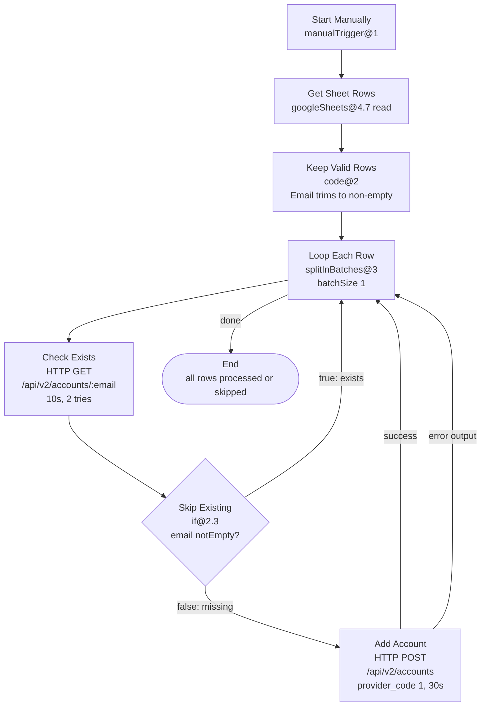

# n8n-instantly-smtp-bulk-upload
> Bulk-upload custom SMTP/IMAP email accounts to Instantly.ai from Google Sheets with duplicate-skip and skip-on-failure. The sheet is read-only input — nothing is ever written back.
[](#prerequisites) [](#workflow-at-a-glance--7-nodes) [](#google-sheet-preparation) [](#prerequisites)
## Pitch
Manually adding dozens or hundreds of custom SMTP mailboxes in the Instantly.ai UI is slow, error-prone, and unauditable. This repo documents a single production n8n workflow that reads candidate accounts from a Google Sheet, checks each one against Instantly with a per-row `GET /api/v2/accounts/{email}`, creates only missing accounts via `POST /api/v2/accounts` with full IMAP+SMTP settings, and skips failures without halting the run — so a run either creates or skips every row, reruns are safe by construction, and verification happens through the Instantly dashboard count plus the n8n execution log.
## Table of Contents
- [How to Read This Repo](#how-to-read-this-repo)
- [What It Does](#what-it-does)
- [What It Does NOT Do](#what-it-does-not-do)
- [Architecture](#architecture)
- [Conventions You Must Know](#conventions-you-must-know)
- [Workflow at a Glance — 7 Nodes](#workflow-at-a-glance--7-nodes)
- [Prerequisites](#prerequisites)
- [Google Sheet Preparation](#google-sheet-preparation)
- [Credentials Setup](#credentials-setup)
- [Import the Workflow](#import-the-workflow)
- [5-Minute Quickstart](#5-minute-quickstart)
- [2-Row Smoke Test](#2-row-smoke-test)
- [Repository Layout](#repository-layout)
- [Next Steps](#next-steps)
- [Troubleshooting Preview](#troubleshooting-preview)
- [Maintenance and Versioning](#maintenance-and-versioning)
## How to Read This Repo
This README is the onboarding front door. It gets you from zero to a first green run. Read it fully once; then use the companions for depth and operations.
| Document | Purpose | When to read it |
|----------|---------|-----------------|
| `docs/README.md` (this file) | Onboarding, prerequisites, sheet prep, credentials, import, quickstart, smoke test | Start here. Read Sections 1–12 in order. |
| `docs/GUIDE.md` | Deep-dive operator guide: every node, expression, mapping, customization recipes | After first green run or when changing logic. |
| `docs/RUNBOOK.md` | Day-2 operations: monitoring, re-runs, triage, rate limits, rollback, scheduling | Before scheduling or when something fails. |
| `workflows/instantly-smtp-accounts-bulk-upload.json` | Canonical workflow JSON, single source of truth | Import this; do not hand-rebuild from screenshots. |
How to use this guide:
1. First-time setup: read top to bottom. Do not skip Conventions — `Email` vs `email` casing causes most first-run failures.
2. Second run and beyond: jump to 5-Minute Quickstart and `RUNBOOK.md`.
3. Customization: go to `GUIDE.md` for field maps and safe edit recipes.
4. All paths are relative to repo root. Canonical workflow is always:
```text
workflows/instantly-smtp-accounts-bulk-upload.json
```
> Rule: if the n8n canvas and the JSON file disagree, the JSON file wins. Re-import from `workflows/` and re-apply IDs and keys.
## What It Does
- Reads a Google Sheet as input. `Get Sheet Rows` pulls every row from the accounts sheet (columns A–K, header + data). Nothing is ever written back.
- Drops unusable rows up front. `Keep Valid Rows` (Code gate, `code@2`) keeps only rows whose `Email` has non-whitespace content — empty and whitespace-only trailing rows never enter the loop. (A plain "is not empty" check lets a `" "` cell through; the trim-aware gate does not.)
- Processes one row at a time. `Loop Each Row` (`splitInBatches`, `batchSize: 1`) isolates each account so one bad row never aborts the batch.
- Probes Instantly per row. `Check Exists` calls `GET https://api.instantly.ai/api/v2/accounts/{{ $json.Email }}` for the loop email (10 s timeout, 2 tries, 1 s between tries).
- Branches on existence. `Skip Existing` (`if@2.3`, `{{ $json.email }}` is `notEmpty`) routes existing accounts straight back to the loop — no POST, no write, no trace except the execution log.
- Creates missing accounts. `Add Account` calls `POST https://api.instantly.ai/api/v2/accounts` with 12 fields including `provider_code: 1` (custom SMTP/IMAP), full name, IMAP and SMTP username/password/host/port (30 s timeout, 2 tries — creates verify live mailboxes and can take a while; a 10 s limit caused real timeouts in production).
- Skips failures forward. `Add Account` uses `onError: continueErrorOutput` routed back to the loop, so one bad credential, typo, or 4xx never aborts the remaining rows. Failure detail lives in the n8n execution log — there is no per-row status anywhere else.
- Is safe to rerun. There is no queue cursor: every run re-checks every row against live Instantly state, existing accounts skip via GET, and only genuinely missing accounts generate POSTs. Reference run: 40 rows → 30 created, 10 skipped, 0 failed.
- Keeps secrets out of logs. Passwords travel sheet → n8n memory → Instantly API over HTTPS; success execution data is not persisted (`saveDataSuccessExecution: none`).
- Runs manually by default. Trigger is `Start Manually` (`manualTrigger@1`). Click Execute when ready. Scheduling is opt-in (see `RUNBOOK.md`).
## What It Does NOT Do
Clarity here prevents incidents. This workflow explicitly does not:
| # | Non-goal | Explanation | Do instead |
|---|----------|-------------|------------|
| 1 | Warm up inboxes | No warmup pools, ramp-up, spam-score checks | Use Instantly warmup separately |
| 2 | Verify DNS (SPF/DKIM/DMARC) | No DNS queries or deliverability checks | Validate DNS before upload; see RUNBOOK pre-flight |
| 3 | Create sheets or workspaces | Assumes sheet, n8n credential, Instantly workspace exist | Follow Prerequisites first |
| 4 | Rotate passwords / update existing accounts | POST is create-only; existing emails are skipped, never patched | Update in Instantly UI or extend per GUIDE.md |
| 5 | Handle Gmail/Outlook OAuth | `provider_code: 1` is generic IMAP/SMTP only | Use Instantly OAuth flows for those |
| 6 | Bulk-delete / disable | No `DELETE` calls anywhere | Delete manually in Instantly |
| 7 | Send campaigns / assign to campaigns | No campaign endpoints called | Assign in Instantly after upload |
| 8 | Record per-row outcomes | No Status column, no write-back of any kind | Audit via execution log + dashboard delta |
| 9 | Mask sheet-stored secrets | IMAP/SMTP passwords live in sheet in cleartext by API necessity | Lock down sheet sharing + n8n access |
| 10 | Guarantee upstream API stability | Endpoints, limits, error shapes can change | Re-smoke-test after changelogs |
> If you need any of the above, treat this as a starting template — do not assume it already covers that case.
## Architecture
### Data flow in one sentence
Google Sheet (11 columns, read-only) → trim-aware gate → Loop (1-by-1) → GET exists? → skip straight back, or POST if missing → loop back; failures skip forward the same way.
### Mermaid graph
Renders on GitHub, GitLab, and most docs sites.

### Execution semantics
```text
Manual trigger
  └─ Get Sheet Rows (one n8n item per sheet row)
       └─ Keep Valid Rows (drops empty/whitespace-Email rows)
            └─ Loop Each Row (batchSize=1)
                 ├─ iteration N: Check Exists (GET loop email)
                 │    ├─ email returned → Skip Existing=true → loop back (no POST)
                 │    └─ email empty/404 → Skip Existing=false → Add Account (POST)
                 │         ├─ 200/201 → loop back
                 │         └─ error output → loop back (skip, logged in execution)
                 └─ no more items → done branch → end
```
Key properties:
- Sequential. `batchSize: 1` avoids rate-limit bursts and keeps per-row outcomes unambiguous.
- Stateless. No queue cursor, no write-back. Dedupe comes from live Instantly state on every run.
- Fail-soft everywhere. Both the skip path and both `Add Account` outputs converge back to the loop; nothing except a failed pre-loop node can halt a run.
## Conventions You Must Know
Read twice. Most first-run tickets trace to one of these three.
### Email (capital E) vs email (lowercase e)
Two different fields from two systems. Mixing them breaks the GET URL or IF branch.
| Field | Casing | Source | Example | Where it appears |
|-------|--------|--------|---------|------------------|
| `Email` | Capital E | Google Sheets header | `maria@acme.co` | Get Sheet Rows, Keep Valid Rows, Check Exists URL |
| `email` | Lowercase e | Instantly API JSON | `maria@acme.co` | Skip Existing condition, Add Account POST body |
Rules:
- Sheet side is always `Email`. Header must be exactly `Email`.
- API side is always `email`. Instantly returns `{ "email": "..." }`. `Skip Existing` tests `{{ $json.email }}` (lowercase).
- Bridge is the `Check Exists` URL, injecting the sheet value into the API call:
```javascript
// Check Exists — GET URL. $json is the loop item (Sheets row), so Email is capital-E.
https://api.instantly.ai/api/v2/accounts/{{ $json.Email }}
```
```javascript
// Skip Existing — IF condition. $json is the Instantly GET response, so email is lowercase-e.
// string 'email' is notEmpty → true = exists → skip POST; false = missing → POST
{{ $json.email }}
```
> Mnemonic: Capital `Email` comes from the Sheet; lowercase `email` comes from Instantly.
### Normalization: trim().toLowerCase()
Email matching is URL-sensitive but mailbox-insensitive. The workflow normalizes before comparison wherever an email is a key (`Check Exists` URL, POST `email`, gate). Keep the chain everywhere email is a key. If you add nodes, copy `trim().toLowerCase()`.
### Numeric coercion: Number()
Instantly expects integers for ports and `provider_code`. Sheets returns strings even for numeric cells. The POST body coerces:
```javascript
{
  "provider_code": 1,
  "imap_port": "{{ Number($json['IMAP Port']) }}",
  "smtp_port": "{{ Number($json['SMTP Port']) }}"
}
```
Rules:
- Always wrap ports in `Number()`. Sending `"993"` (quoted) is rejected or misinterpreted.
- `provider_code` is literal `1`, not from sheet. `1` = generic SMTP/IMAP.
- Empty ports become `0`/`NaN` and fail API validation — the row skips forward via the error edge. Validate the sheet per next section instead of relying on that.
## Workflow at a Glance — 7 Nodes
Canvas order (left → right):
| # | Node name | Type + version | Operation | Purpose |
|---|-----------|----------------|-----------|---------|
| 1 | Start Manually | `manualTrigger@1` | manual trigger | Entry point; click Execute. |
| 2 | Get Sheet Rows | `googleSheets@4.7` | read | Loads all rows from accounts sheet. |
| 3 | Keep Valid Rows | `code@2` | trim-aware filter | Drops rows with empty/whitespace `Email`. |
| 4 | Loop Each Row | `splitInBatches@3` | `batchSize: 1` | One account per pass. |
| 5 | Check Exists | `httpRequest@4.5` | `GET /api/v2/accounts/{{ $json.Email }}` | Asks if mailbox exists (10 s, 2 tries). |
| 6 | Skip Existing | `if@2.3` | `{{ $json.email }}` is `notEmpty` | Branch: skip POST vs create. |
| 7 | Add Account | `httpRequest@4.5` | `POST /api/v2/accounts`, 12 fields, `provider_code: 1` | Creates missing account (30 s, 2 tries). |
Connections:
```text
Start Manually → Get Sheet Rows → Keep Valid Rows → Loop Each Row
Loop Each Row (loop) → Check Exists → Skip Existing
Skip Existing (true) → Loop Each Row (back-edge, clean skip)
Skip Existing (false) → Add Account → Loop Each Row (back-edge)
Add Account (error output) → Loop Each Row (back-edge, skip-on-failure)
Loop Each Row (done) → end
```
### Node 1 — Start Manually (manualTrigger@1)
Manual entry point. No webhook, schedule, or polling. Bulk credential uploads deserve a human gate: review sheet, then Execute.
```json
{ "name": "Start Manually", "type": "n8n-nodes-base.manualTrigger", "typeVersion": 1, "parameters": {} }
```
### Node 2 — Get Sheet Rows (googleSheets@4.7 read)
Reads full data range. Credential: Google OAuth2. Output: one item per row, keys exactly matching headers (`Email`, `First Name`, …, `SMTP Port`) — 11 columns, no `Status`.
> The Sheets node is read-only in this workflow. Nothing ever writes to the sheet.
### Node 3 — Keep Valid Rows (code@2 trim gate)
```javascript
// Keeps rows whose Email has non-whitespace content. Returns original
// items untouched so downstream pairing stays intact.
return $input.all().filter((item) => String(item.json?.Email ?? '').trim() !== '');
```
Why Code and not Filter: n8n's string `isEmpty` treats `" "` (whitespace-only trailing cells) as non-empty, so phantom rows used to sail into the loop and crash the POST body expression. The trim-aware gate drops them before the loop. Gotcha history: this exact failure mode halted debugging for a full session before the gate existed.
### Node 4 — Loop Each Row (splitInBatches@3 batchSize 1)
`batchSize: 1`. `loop` emits one item per iteration; `done` fires when exhausted. Three back-edges converge here (skip, success, error). Do not raise the batch size without reading RUNBOOK rate-limit guidance.
### Node 5 — Check Exists (httpRequest@4.5 GET)
`GET https://api.instantly.ai/api/v2/accounts/{{ $json.Email }}`. Auth header `Authorization: Bearer <key>` (live key pasted in n8n; never commit real key). Input `$json` is the loop item so `Email` is capital-E. `200` with `{ "email": "…" }` = exists; `404`/empty = missing. Retries: 2 tries (lookups are instant; failures here are auth/network, not patience problems).
```http
GET https://api.instantly.ai/api/v2/accounts/maria@acme.co
Authorization: Bearer <live-key>
Accept: application/json
```
### Node 6 — Skip Existing (if@2.3)
Condition `{{ $json.email }}` (lowercase, from GET response) is `notEmpty` (string). True → exists → straight back to the loop (no POST). False → missing → to Add Account. This is the Email-vs-email trap in miniature — keep it lowercase.
### Node 7 — Add Account (httpRequest@4.5 POST 12 fields)
`POST https://api.instantly.ai/api/v2/accounts`. Same `Authorization` header. JSON body with 12 fields, `provider_code: 1`. Ports via `Number()`; email via `trim().toLowerCase()`. Retries: 2 tries, 30 s timeout — creates make Instantly dial the live mailbox, and a 10 s limit caused real `ECONNABORTED` timeouts in production. Both outputs (success + error) loop back, so failures skip forward.
```json
{
  "email": "={{ $json.Email.toString().trim().toLowerCase() }}",
  "first_name": "={{ $json['First Name'] }}",
  "last_name": "={{ $json['Last Name'] }}",
  "provider_code": 1,
  "imap_username": "={{ $json['IMAP Username'] }}",
  "imap_password": "={{ $json['IMAP Password'] }}",
  "imap_host": "={{ $json['IMAP Host'] }}",
  "imap_port": "={{ Number($json['IMAP Port']) }}",
  "smtp_username": "={{ $json['SMTP Username'] }}",
  "smtp_password": "={{ $json['SMTP Password'] }}",
  "smtp_host": "={{ $json['SMTP Host'] }}",
  "smtp_port": "={{ Number($json['SMTP Port']) }}"
}
```
(Field reference table lives in `GUIDE.md`.)
## Prerequisites
Do not start quickstart until every row is green.
### Platform
| Requirement | Minimum | Recommended | Notes |
|-------------|---------|-------------|-------|
| n8n version | `>= 1.x` (any 1.x) | Latest stable 1.x | Uses `executionOrder: v1`. Cloud or self-host. |
| Browser | Evergreen Chrome/Edge/Firefox | Chrome | For OAuth + canvas. |
| Network egress | HTTPS to `googleapis.com`, `oauth2.googleapis.com`, `api.instantly.ai` | Same | Allowlist on corporate proxies. |
### Required node versions
Live workflow pins these `typeVersion` values:
| Node | Type string | Pinned typeVersion |
|------|-------------|--------------------|
| Start Manually | `n8n-nodes-base.manualTrigger` | `1` |
| Get Sheet Rows | `n8n-nodes-base.googleSheets` | `4.7` |
| Keep Valid Rows | `n8n-nodes-base.code` | `2` |
| Loop Each Row | `n8n-nodes-base.splitInBatches` | `3` |
| Check Exists | `n8n-nodes-base.httpRequest` | `4.5` |
| Skip Existing | `n8n-nodes-base.if` | `2.3` |
| Add Account | `n8n-nodes-base.httpRequest` | `4.5` |
### Google account and OAuth
| Requirement | Details |
|-------------|---------|
| Google account | Any with Sheets access; workspace account recommended for teams. |
| OAuth consent | Approve Sheets OAuth scopes in n8n (`spreadsheets` read — this workflow never writes). |
| Sheet access | `Viewer` suffices (read-only workflow); `Editor` only if you also edit the sheet as that identity. |
| Credential type | `Google Sheets OAuth2 API` (`googleSheetsOAuth2Api`). |
### Instantly.ai account and API scopes
| Requirement | Details |
|-------------|---------|
| Plan | Paid workspace (free/trial may lack API or quota). |
| API key | Settings → API. One key per workspace. Treat like password. |
| Scopes | `accounts:read` (Check Exists GET) + `accounts:create` (Add Account POST). |
| Quota | Enough slots for batch. Check Limits before large runs. |
| Base URL | `https://api.instantly.ai/api/v2` — no trailing slash. |
### Access checklist
- [ ] n8n `>= 1.x` reachable, can create + execute workflows.
- [ ] Google OAuth credential created (or permission to create one).
- [ ] Instantly paid workspace + key with `accounts:read` + `accounts:create`.
- [ ] 2 test mailboxes (disposable/staging) for smoke test.
## Google Sheet Preparation
### Create the sheet
1. Create new Google Sheet (e.g., `Instantly SMTP Upload`).
2. Rename first tab to `Accounts` (workflow default `sheetName`).
3. Paste header below into row 1, columns A–K. Spelling, spacing, order must match exactly — workflow references headers by name. There is deliberately no twelfth column: no `Status`, no outcome tracking in the sheet.
### Canonical CSV header (copy-paste)
```csv
Email,First Name,Last Name,IMAP Username,IMAP Password,IMAP Host,IMAP Port,SMTP Username,SMTP Password,SMTP Host,SMTP Port
```
Expected layout after paste:
| Email | First Name | Last Name | IMAP Username | IMAP Password | IMAP Host | IMAP Port | SMTP Username | SMTP Password | SMTP Host | SMTP Port |
|-------|------------|-----------|---------------|---------------|-----------|-----------|---------------|---------------|-----------|-----------|
| maria@acme.co | Maria | Diaz | maria@acme.co | •••••• | imap.acme.co | 993 | maria@acme.co | •••••• | smtp.acme.co | 587 |
| sam@acme.co | Sam | Lee | sam@acme.co | •••••• | imap.acme.co | 993 | sam@acme.co | •••••• | smtp.acme.co | 587 |
Column reference:
| Col | Header (exact) | Required | Example | Notes |
|-----|----------------|----------|---------|-------|
| A | `Email` | Yes | `maria@acme.co` | Lowercase preferred; unique per row. |
| B | `First Name` | Yes | `Maria` | Sent as `first_name`. |
| C | `Last Name` | Yes | `Diaz` | Sent as `last_name`. |
| D | `IMAP Username` | Yes | `maria@acme.co` | Usually same as email. |
| E | `IMAP Password` | Yes | `app-password-xyz` | App password for most providers. |
| F | `IMAP Host` | Yes | `imap.acme.co` | No `https://`, no trailing slash. |
| G | `IMAP Port` | Yes | `993` | Typically `993` or `143`. Digits only. |
| H | `SMTP Username` | Yes | `maria@acme.co` | Sent as `smtp_username`. |
| I | `SMTP Password` | Yes | `app-password-xyz` | Often same as IMAP password. |
| J | `SMTP Host` | Yes | `smtp.acme.co` | No protocol prefix. |
| K | `SMTP Port` | Yes | `587` | Typically `587` or `465`. Digits only. |
### Data hygiene rules
- One account per row. Dedupe column A (Data → Remove duplicates) before running (in-sheet dupes POST twice; the second 400s and skips — harmless but wasteful).
- No blank `Email` rows. Delete empty trailing rows — the gate drops them, but a clean sheet runs cleaner.
- Trim whitespace. Spaces in `Email`/hosts/usernames are #1 first-run failure. Use `=TRIM(A2)` helper, paste values back.
- Ports digits only. `993`, not `993/tcp`.
- Freeze row 1 (View → Freeze → 1 row) so sorting never buries headers.
- Copy Sheet ID now. From `https://docs.google.com/spreadsheets/d/YOUR_GOOGLE_SHEET_ID/edit`, copy middle segment for the Sheets node.
## Credentials Setup
Two touchpoints: one Sheets OAuth credential; one API-key header shared by two HTTP nodes; plus one sharing step.
### Google OAuth — Get Sheet Rows
1. n8n → Credentials → New → Google Sheets OAuth2 API.
2. Connect account with access to the sheet; approve Sheets scopes (read suffices).
3. Name e.g. `Google Sheets – Instantly Upload`.
4. Canvas → `Get Sheet Rows` → Credential → select it.
### Instantly API key — both HTTP nodes
Apply to both `Check Exists` (GET) and `Add Account` (POST) — same key in both places:
1. Instantly → Settings → API → create/copy key (needs `accounts:read` + `accounts:create`).
2. `Check Exists` → Headers: Name `Authorization`, Value `Bearer <real-key>` (one space after Bearer).
3. `Add Account` → set identical header.
| Node | Header name | Header value (after setup) |
|------|-------------|----------------------------|
| Check Exists | `Authorization` | `Bearer sk-live-…` (your key) |
| Add Account | `Authorization` | `Bearer sk-live-…` (same key) |
> Security: never commit real key. Live values live in n8n only. Rotate in Instantly if a key appears in a log, screenshot, or export.
Quick header test (redacted):
```bash
curl -s -o /dev/null -w "%{http_code}\n" \
  -H "Authorization: Bearer $INSTANTLY_API_KEY" \
  https://api.instantly.ai/api/v2/accounts
# 200 = auth works (list endpoint) | 401/403 key or scopes wrong
```
### Share the sheet with the OAuth identity
1. Sheets → Share → add same Google account you OAuth'd with (Viewer is enough — the workflow never writes).
2. Confirm: `Get Sheet Rows` → Document → paste sheet ID → Execute Step returns rows. `403`/`not found` here is always sharing/ID problem, never Instantly.
Checklist:
- [ ] Sheets node: OAuth wired, sheet ID replaced.
- [ ] Both HTTP nodes: same `Authorization: Bearer …` live key.
- [ ] Sheet shared with OAuth identity.
- [ ] No live secrets in exported JSON.
## Import the Workflow
### Import steps
1. Confirm canonical file exists:
```bash
ls -l workflows/instantly-smtp-accounts-bulk-upload.json
```
2. n8n → Workflows → ⋯ → Import from File → select that JSON.
3. Verify canvas shows 7 nodes with the exact names in [Workflow at a Glance](#workflow-at-a-glance--7-nodes). Accept `typeVersion` migration prompt if shown.
Confirm settings:
| Setting | Expected | Why |
|---------|----------|-----|
| `active` | `false` | Manual gate: run deliberately, not on restart. |
| `executionOrder` | `v1` | Loop + ordering tested against v1. |
| `saveDataSuccessExecution` | `none` | Success payloads carry passwords — do not persist them. |
| `saveManualExecutions` | `true` | Manual runs must be saved, or failures leave no audit trail. |
## Import-time validation
In n8n UI:
- [ ] 7/7 nodes, no unknown-node banners.
- [ ] No red credential warnings.
- [ ] `Get Sheet Rows → Execute Step` returns rows.
- [ ] Toggle shows Inactive (deliberate).
## 5-Minute Quickstart
Assumes prerequisites, sheet, credentials done. ~5 min for 2 rows.
| Minute | Action | Where |
|--------|--------|-------|
| 0:00–1:00 | Confirm 2 valid rows | Google Sheets |
| 1:00–2:00 | Confirm Inactive + credentials green | n8n canvas |
| 2:00–3:00 | Click Execute workflow, watch loop | n8n executions |
| 3:00–4:00 | Check Instantly dashboard count delta | Instantly → Accounts |
| 4:00–5:00 | Inspect execution: skips vs creates | n8n execution detail |
Steps:
1. Prep 2 rows with valid test credentials.
2. Open workflow. Toggle reads Inactive — manual runs work while inactive; expected.
3. Click Execute workflow. `Loop Each Row` pulses per row.
4. Instantly: Accounts count rises by the number of genuinely new addresses.
5. Execution detail: each iteration either skipped (exists) or POSTed (new); failures appear as error-branch items with the API message.
6. Re-run safety demo: Execute again without sheet edits. Only GETs fire, zero POSTs — existing accounts all skip. Proves idempotency.
```text
Run 1 (all new): GET x2 → POST x2 ✅
Run 2 (no edits): GET x2 → skip x2, no POSTs ✅ no-op
```
Reference run: 40 rows → 30 created, 10 skipped, 0 failed in ~2 min.
If a row fails, find its error in the execution log (never in the sheet — nothing is written there). Full triage in `RUNBOOK.md`.
## 2-Row Smoke Test
Prove pipeline before real data. Use staging/disposable mailboxes, never production.
### Fixture (paste into rows 2–3, columns A–K)
```csv
Email,First Name,Last Name,IMAP Username,IMAP Password,IMAP Host,IMAP Port,SMTP Username,SMTP Password,SMTP Host,SMTP Port
smoke01@test-acme.dev,Smoke,ZeroOne,smoke01@test-acme.dev,REPLACE_IMAP_PASS_01,imap.test-acme.dev,993,smoke01@test-acme.dev,REPLACE_SMTP_PASS_01,smtp.test-acme.dev,587
smoke02@test-acme.dev,Smoke,ZeroTwo,smoke02@test-acme.dev,REPLACE_IMAP_PASS_02,imap.test-acme.dev,993,smoke02@test-acme.dev,REPLACE_SMTP_PASS_02,smtp.test-acme.dev,587
```
> Replace `REPLACE_*` with real test passwords.
### Expected results
| Step | Expected |
|------|----------|
| Get Sheet Rows | ≥ 2 items |
| Keep Valid Rows | 2 items through |
| Loop Each Row | 2 passes, then done |
| Check Exists (first run) | 404 → false branch |
| Add Account | 200/201, response contains lowercase email |
| Second Execute (no edits) | GETs only, all skip, no POSTs |
| Instantly UI | Both smoke accounts visible |
### Pass / fail criteria
- PASS: both rows created (dashboard +2); second run no-op; both searchable in Instantly.
- FAIL: execution shows error-branch items. Map with starter table (full table in `RUNBOOK.md`):
| Symptom | Likely cause | Fix |
|--------------|--------------|-----|
| 401 on GET+POST | Wrong key or scopes | Re-paste key in both HTTP nodes; confirm accounts:read/create |
| 404 on POST / wrong base URL | Wrong base URL / workspace | Confirm `https://api.instantly.ai/api/v2/accounts`, correct key |
| 400 invalid port / 422 | Ports not digits | Fix to `993`/`587`, rerun |
| Timeout ECONNABORTED on POST | Mailbox verification slower than timeout | Raise POST timeout (live: 30 s), rerun — rerun skips if it landed |
| Auth failed (IMAP/SMTP) | Mailbox password/host wrong | Verify in mail client; use app passwords |
### Clean up after smoke test
- Delete/disable smoke accounts in Instantly if test-only.
- Load real batch in chunks (25–50 rows per run; see `RUNBOOK.md` for batch sizing).
## Repository Layout
```text
n8n-instantly-smtp-bulk-upload/
├── workflows/instantly-smtp-accounts-bulk-upload.json  # canonical workflow (import this)
├── docs/README.md    # you are here (onboarding)
├── docs/GUIDE.md     # deep-dive operator guide
├── docs/RUNBOOK.md   # production operations + triage
├── README.md         # landing (points here)
└── LICENSE
```
Conventions:
- After canvas changes: Export → overwrite `workflows/instantly-smtp-accounts-bulk-upload.json` → commit naming nodes touched.
- Never commit live secrets. Git must never show a live key or real sheet ID.
## Next Steps
| Goal | Go to |
|------|-------|
| Every node, expression, 12-field POST map in depth | [GUIDE.md](./GUIDE.md) — operator guide |
| Schedule, batch sizing, triage failures, rate limits, rollback | [RUNBOOK.md](./RUNBOOK.md) — runbook |
| Import and run | Import + Quickstart above |
| Customize safely (new columns, dry-run, Slack alerts) | GUIDE.md customization recipes |
Suggested path:
1. ✅ This README (theory done).
2. → GUIDE.md Node-by-node — read both HTTP nodes fully.
3. → RUNBOOK.md Pre-flight — print for first real batch.
4. → Schedule only after 3 consecutive clean manual runs.
## Troubleshooting Preview
Full trees in `RUNBOOK.md`. Three onboarding blockers:
### Get Sheet Rows returns 0 items or errors
| Symptom | Cause | Fix |
|---------|-------|-----|
| `403 PERMISSION_DENIED` | Not shared with OAuth identity | Share with OAuth account; re-execute |
| `404 File not found` | Wrong Sheet ID | Re-copy ID; no extra chars |
| 0 items, no error | Wrong tab / sheetName | Set tab to `Accounts` or match param |
| Headers with undefined keys | Header typo/case | Restore exact CSV header above |
### Everything fails with 401
Both HTTP nodes share the same key. Fixing one and forgetting the other leaves half the graph broken. Paste the SAME live key into BOTH nodes, Save, rerun.
### Loop processes 0 rows but the sheet has data
- `Keep Valid Rows` drops every row with a blank/whitespace `Email`. Check `=LEN(TRIM(A2))=0` rows — delete empty trailing rows.
- Confirm the loop is reached (green `Keep Valid Rows` with items out).
> Still stuck? Capture execution ID and the failing node's output JSON, then follow RUNBOOK.md triage.
## Maintenance and Versioning
| Item | Policy |
|------|--------|
| Canonical artifact | `workflows/instantly-smtp-accounts-bulk-upload.json` in git; re-export from canvas after changes. |
| Settings | Keep `active: false`, `executionOrder: v1`, `saveDataSuccessExecution: none`, `saveManualExecutions: true` unless RUNBOOK scheduling says otherwise. |
| Node upgrades | Accept migrations, diff vs 7-node list, run smoke test. |
| Failures leave no sheet trail | Audit via execution log + dashboard delta only. |
| Change log | Commit messages name nodes (e.g., `fix(Add Account): raise timeout to 30s`). |
| Secret hygiene | Live values in n8n runtime only; never in git. |
| Review cadence | Re-smoke-test quarterly or after n8n minor / Instantly changelog. |
## License and Support
- License: see `LICENSE` at root.
- Support: file issue with n8n version, 7 node versions, failing node output JSON. Never paste live keys or passwords.
- Contributing: PRs welcome for docs. PRs embedding live credentials closed without review.
*You are ready. Open the live workflow, run the 2-row smoke test, then continue with [GUIDE.md](./GUIDE.md) for mastery and [RUNBOOK.md](./RUNBOOK.md) for production confidence. Happy uploading.*
